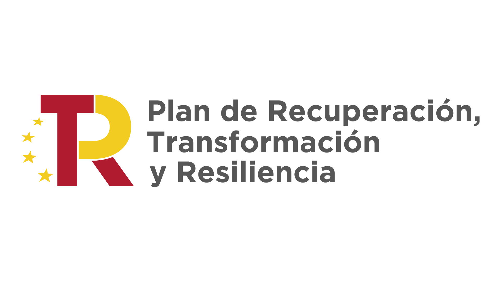
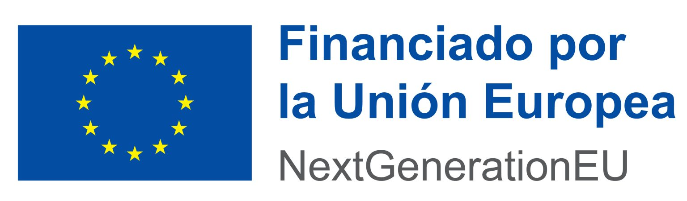

# Herramientas DIY para Robots Colaborativos (UR)

Este proyecto se centra en el **diseño, fabricación e integración de herramientas de bajo coste** para cobots de Universal Robots, utilizando procesos de fabricación DIY (Do It Yourself) y su aplicación en entornos industriales y educativos.

## 📋 Descripción del Proyecto
El objetivo principal ha sido desarrollar un ecosistema de herramientas funcionales (como pinzas y sistemas de iluminación) que se integran nativamente con el software del robot mediante **URCaps**. Esto permite a centros de formación y pequeñas industrias acceder a aplicaciones de robótica colaborativa sin los altos costes de las herramientas comerciales.

## 🚀 Características Técnicas
*   **Controlador:** Basado en ESP32-WROOM-32 con conectividad Ethernet (W5500).
*   **Comunicación:** Protocolo TCP/IP mediante buffers cíclicos de 32 bytes para el intercambio de datos en tiempo real.
*   **Actuadores:** Control de motores con PID y monitorización de corriente.
*   **Interfaz:** Integración completa en PolyScope mediante URCaps personalizadas.

## 📁 Estructura del Repositorio
*   `docs/`: Documentación técnica y especificaciones.
*   `hardware/`: Esquemas eléctricos y diseño de la PCB.
*   `firmware/`: Código C++ para el sistema de control.
*   `software/`: Código de las URCaps y app de configuración.
*   `mecanica/`: Modelos 3D para impresión.
*   `URcaps/`: URcaps para instalar en Polyscope.

## 👥 Centros Participantes
Este proyecto ha sido una colaboración entre:
*   **IES La Valldigna** (Centro coordinador)
*   **IES Jaume Huguet**
*   **Institut Tecnològic de Barcelona**
*   **IES Federica Montseny**
*   **Universal Robots España** (Apoyo técnico y formación)

## 💰 Financiación

Este proyecto ha sido posible gracias a la financiación de las siguientes instituciones:

<table>
  <tr>
    <td align="center" width="33%">
      
    </td>
    <td align="center" width="33%">
      
    </td>
    <td align="center" width="33%">
      
    </td>
  </tr>
</table>

Proyecto financiado por el **Ministerio de Educación, Formación Profesional y Deportes** y la **Unión Europea (NextGenerationEU)** en el marco del Plan de Recuperación, Transformación y Resiliencia.
